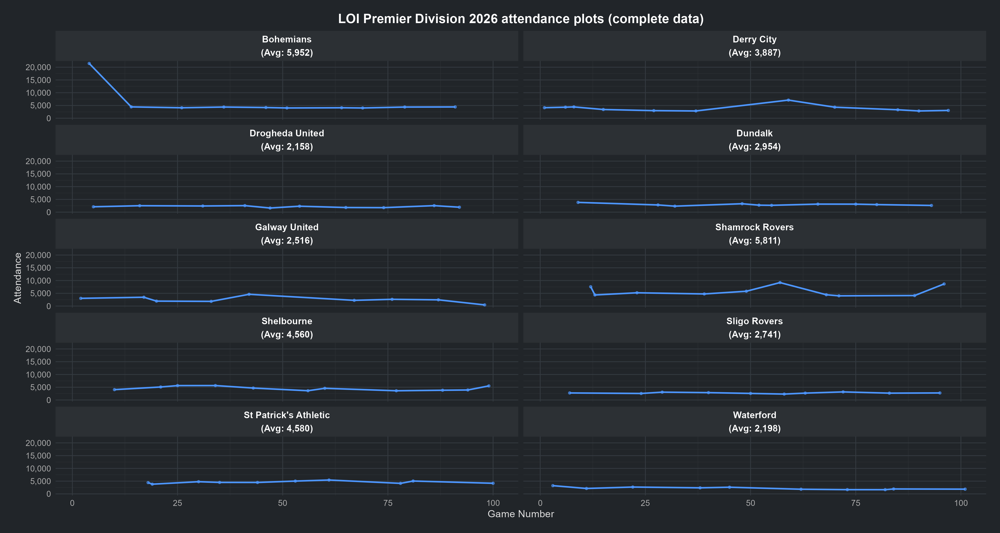

# League of Ireland (LOI) 2026 attendance plots

The following is a time-series dashboard for matchday attendances across the 101 games played to date in the 2026 League of Ireland Premier Division using `R` and `ggplot2`. 

The visualisations are split into two separate plots to account for the fact that the game between Bohemians and St Patrick's Athletic on Sunday, February 8, 2026 was held at 
the Aviva Stadium. The fixture attracted an attendance of 21,472 - the highest crowd of the 2026 LOI Premier Division campaign.

---

## 📊 Visualisations and analytical context

### Plot 1: Complete dataset (including Aviva Stadium outlier)
This plot includes Bohemians' nominal home match against St Pat's at the Aviva Stadium.



* **The design:** All charts share a locked scale (20,000+ attendance) so you can compare them accurately at a glance. 
* **The downside:** Because the scale is so large, normal matchday crowds get squished at the bottom of the chart. It makes regular ups and downs look like flat lines.

### Plot 2: Standard home grounds profile (excluding Aviva Stadium outlier)
This plot removes the Aviva Stadium match between Bohs and St Pat's to focus on typical weekly crowds at regular home grounds like Dalymount Park and Tallaght Stadium.


* **The design:** With the massive spike gone, each team's chart now uses its own individual scale.
* **The benefit:** Each graph now resizes perfectly to fit that specific stadium. Smaller grounds like Drogheda zoom in on their circa 2,500 maximum capacity, while larger venues like Shamrock Rovers can scale up past 10,000. You can finally see the real weekly ups and downs for every team.
---

## 🛠️ Data processing & layout rules

The underlying scripts handle your visualisation processing through three specific phases:

### 🛠️ Key dashboard features

#### 1. Dynamic headers
* **The design:** Instead of cluttering the charts with messy text labels, the code automatically calculates each team's average attendance.
* **The benefit:** It bakes these averages straight into the team name headers (eg: `Bohemians (Avg: 4,228)`), keeping the actual graphs completely clean.

#### 2. Timeline tracking
* **The Design:** Matches are plotted left-to-right in the exact chronological order they were played.
* **The Benefit:** This turns a separate list of attendance figures into a continuous timeline, showing exactly how crowds grew or shrank as the season went on.

#### 3. High-contrast dark theme
* **The Design:** The dashboard uses a modern, deep-charcoal dark background instead of standard white grids.
* **The Benefit:** This subtle backdrop makes the bright blue trendlines and data points instantly pop, making the charts much easier to read on digital screens.

---

## 🛠️ Required packages

To run this script, you only need three core R libraries:

```r
library(dplyr)    # For sorting and calculating the attendance averages
library(ggplot2)  # For building the time-series charts
library(scales)   # For formatting the axis numbers (eg: adding commas to 20,000)
```

